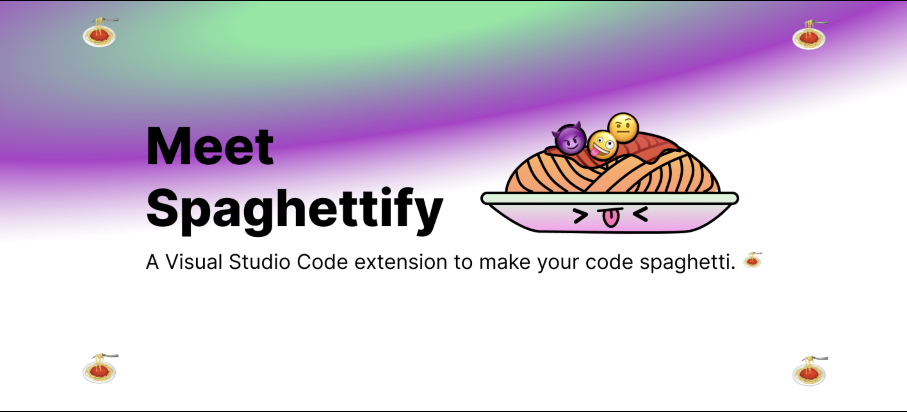

# Spaghettify

Spaghettify is a Visual Studio Code extension that uses the power of AI to make your code worse. 🍝

## How to Use

First, run the `Spaghettify - Setup` command. This will prompt you for an [OpenAI API Key](beta.openai.com/). Input your API key.

Now, run any of the Spaghettify magic brushes to automagically make your code worse. It's that easy!